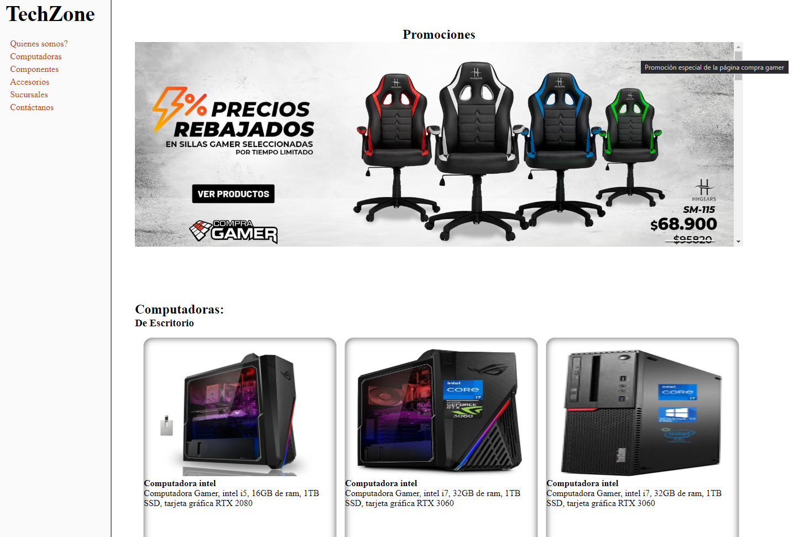
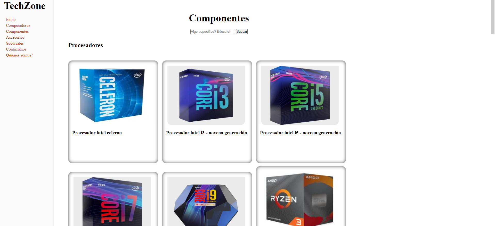
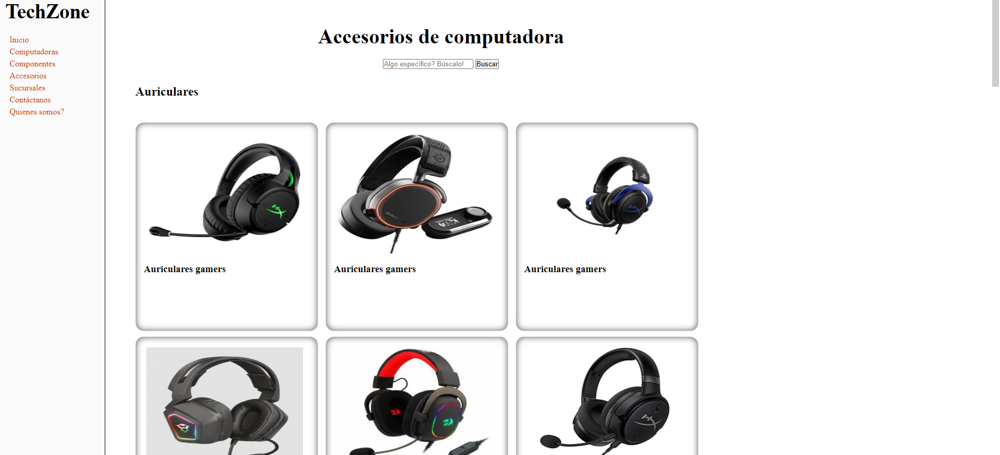
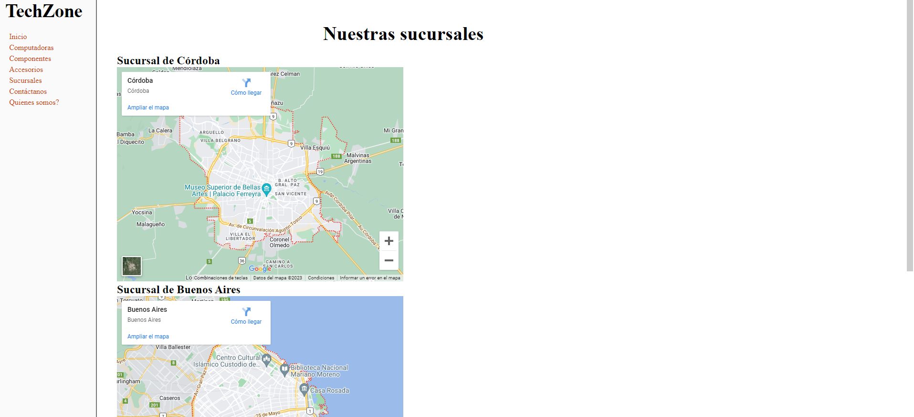
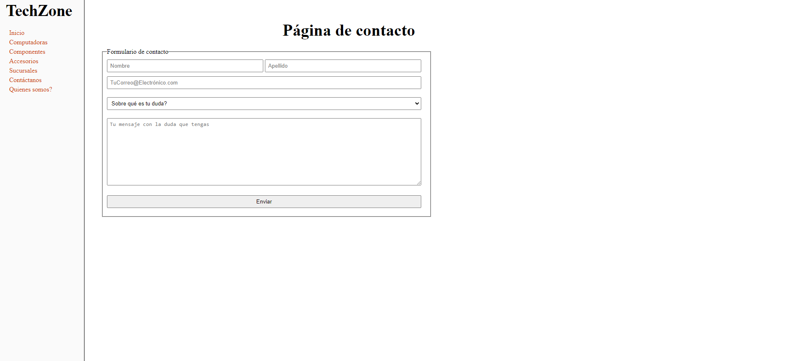
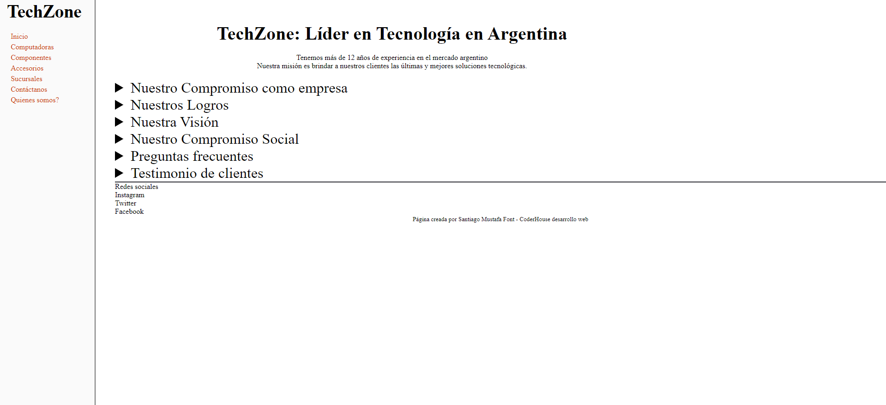

# EN PROCESO

No he podido darle tan buena pinta a la página sin usar grid o flex, lo siento

## TechZone - PROYECTO FINAL -> CoderHouse

## Sobre TechZone

> Página de ventas de productos tecnológicos más importante de la Argentina.
>
> Mira nuestros productos y promociones sin igual, son ofertas únicas del mercado argentino!

## Sobre el proyecto
>
> En este proyecto se busca practicar los principios básicos de html y css aprendidos durante las clases del curso de **Desarrollo web** de **[CoderHouse](https://coderhouse.com)**
>
> Proyecto realizado por: ***Santiago Mustafa Font***
>
> Tecnologías utilizadas para el desarrollo del proyecto
>
> - [x] **HTML**
> - [x] **CSS**

## Avances del proyecto

- [x] Crear del **WireFrame** del proyecto.
- [x] Crear las vistas de **escritorio**, **tablet** y **teléfono**.
- [x] Crear el **header** y **footer** y ponerlo en todas las páginas.
- [x] Agregar el archivo CSS a mi proyecto.
- [x] Agregar estilos a mi proyecto.
- [] Darle el diseño deseado con grid y flex.
- [] Hacer que mi página web sea responsive.

## Screenshot de cada avance del proyecto

### Primera pre-entrega

Index

Computadoras

Componentes

Accesorios

Sucursales

Contacto

Quienes somos?

